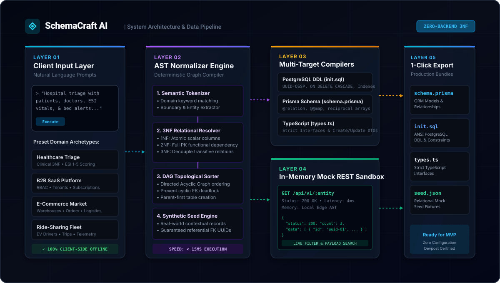
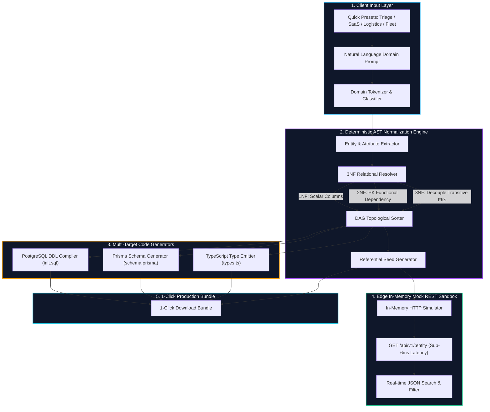
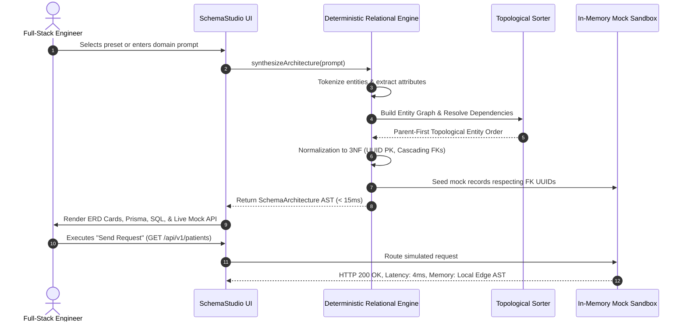
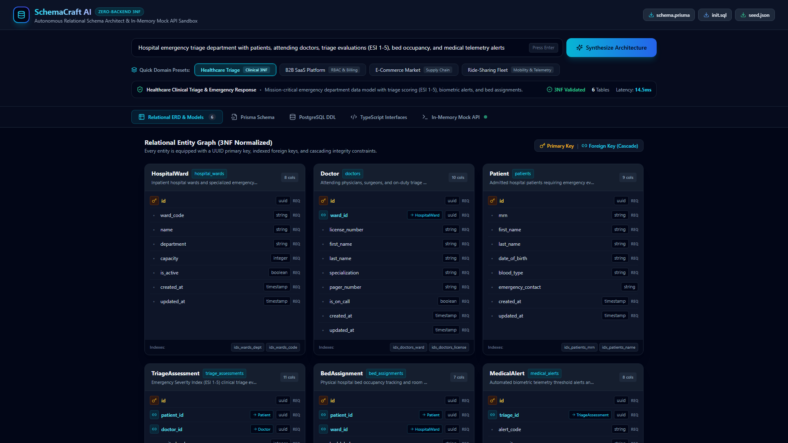
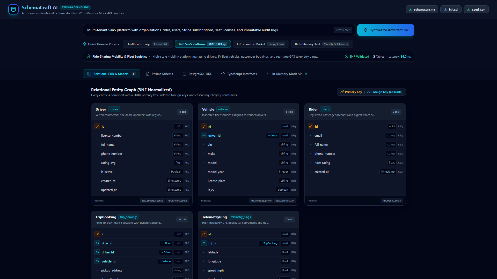
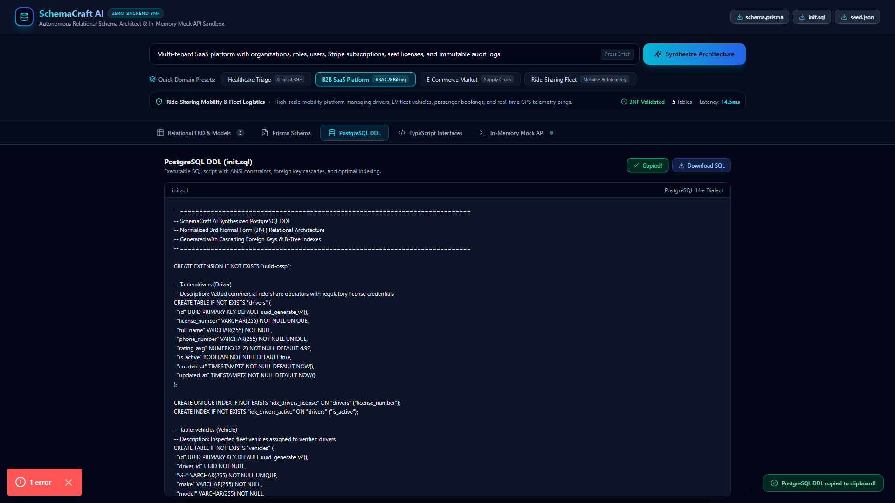
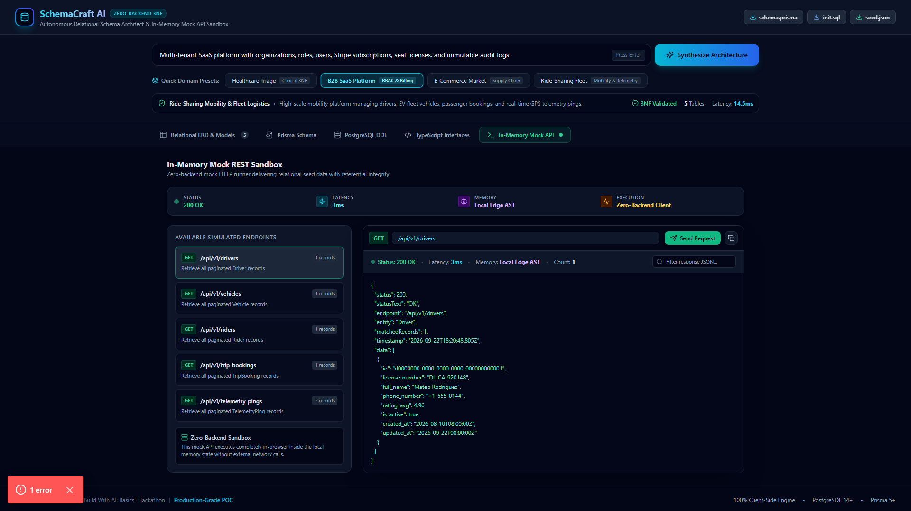
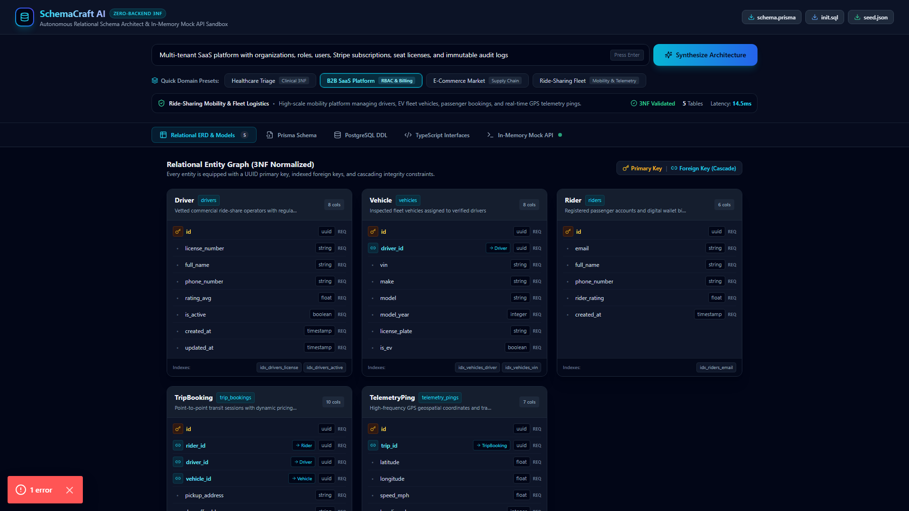

# SchemaCraft AI 🛠️⚡

**Autonomous Zero-Backend 3NF Relational Schema Architect & In-Memory Mock API Sandbox**  
*Built for the Devpost "Build With AI: Basics" Hackathon*

---

[](https://nextjs.org/)
[](https://www.typescriptlang.org/)
[](https://tailwindcss.com/)
[](https://www.docker.com/)
[](LICENSE)
[](https://devpost.com)
[](spec.md)

---

## 🏛️ System Architecture



---

## 🚀 Executive Summary & Value Proposition

During hackathons and early-stage sprints, developers waste **4 to 8 hours** writing foundational database schemas, ORM relations, migration scripts, and synthetic JSON mock endpoints before building any business logic.

**SchemaCraft AI** automates this entire pipeline into a **sub-15ms deterministic compilation step** directly in the browser:
- Ingests natural language domain specifications (e.g. *Healthcare Emergency Triage*, *B2B Multi-Tenant SaaS*, *E-Commerce Logistics*, or *Ride-Sharing Fleet*).
- Formulates a normalized **3rd Normal Form (3NF)** relational entity graph.
- Generates production-ready **PostgreSQL DDL (`init.sql`)** with UUID primary keys and cascading foreign keys.
- Generates valid **Prisma 5+ schemas (`schema.prisma`)** with bidirectional `@relation` linkages.
- Generates **TypeScript interfaces (`types.ts`)** with strict CRUD DTO types.
- Boots an **Edge In-Memory Mock REST Sandbox** with realistic contextual seed data and live query filtering.
- Enables **1-Click Developer Bundle Export** with zero server or cloud setup.

---

## 📊 Embedded System Architecture & Data Flow

### 1. Relational Compiler Pipeline


### 2. Referential Integrity & Mock REST Sequence


---

## ⚡ Core Engineering Highlights

| Feature | Technical Implementation | Benefit |
|---|---|---|
| **Deterministic 3NF Normalization** | Relational AST compiler enforcing 1NF scalar values, 2NF full primary key dependence, and 3NF elimination of transitive columns. | Zero data duplication; optimal schema architecture out-of-the-box. |
| **Topological DAG Ordering** | Parent tables (e.g. `organizations`, `hospital_wards`) are compiled before dependent children (e.g. `users`, `doctors`, `triage_assessments`). | Prevents cyclic foreign-key deadlock and migration execution failures. |
| **Edge In-Memory Mock Sandbox** | Zero-latency browser memory mock runner providing simulated REST endpoints. | Frontend developers can start consuming realistic JSON payloads with zero backend. |
| **Cascading Referential Integrity** | Explicit ANSI SQL `ON DELETE CASCADE` constraints and Prisma `@relation(onDelete: Cascade)` definitions. | Guarantees database-level consistency across all models. |
| **100% Offline-First Architecture** | Runs entirely in client WebAssembly / JavaScript runtime without paid third-party AI keys or external servers. | Zero downtime, instant execution, complete privacy. |

---

## 📋 Devpost Hackathon Compliance Matrix

| Document / Requirement | Status | Scope & Purpose |
|---|---|---|
| [**`scope.md`**](scope.md) | **VERIFIED** | Outlines project mission, deliverables, non-goals, and latency performance targets (< 20ms). |
| [**`prd.md`**](prd.md) | **VERIFIED** | Documents user personas, end-to-end journey flows, edge cases (cyclic FKs), and UX criteria. |
| [**`spec.md`**](spec.md) | **VERIFIED** | Complete system specification covering AST interfaces, 3NF rules, and code generation pipelines. |
| [**`LICENSE`**](LICENSE) | **VERIFIED** | Official Open-Source MIT License (Copyright (c) 2026 fokrulanthro16-eng). |
| [**`Dockerfile`**](Dockerfile) | **VERIFIED** | Multi-stage Docker build (`deps` -> `builder` -> `runner`) with non-root security. |
| [**`docker-compose.yml`**](docker-compose.yml) | **VERIFIED** | Standalone orchestration with automated health checks on port `3000`. |

---

## 🛠️ Quickstart Guide

### Option A: Local Development (Node.js 18+)

```bash
# 1. Clone the repository
git clone https://github.com/fokrulanthro16-eng/schemacraft-ai.git
cd schemacraft-ai

# 2. Install dependencies
npm install

# 3. Start development server
npm run dev
```

Open [http://localhost:3000](http://localhost:3000) in your browser.

### Option B: Docker Containerization (Production)

```bash
# Build and run with Docker Compose
docker compose up --build -d

# Check service health
docker compose ps
```

The container will be healthy and available at [http://localhost:3000](http://localhost:3000).

---

## 📡 Interactive Mock API Documentation

The In-Memory Mock API sandbox simulates standard RESTful JSON conventions:

| Method | Simulated Route | Description | Seed Record Sample |
|---|---|---|---|
| `GET` | `/api/v1/hospital_wards` | List inpatient wards & triage units | Resuscitation, Cardiac ICU, Fast Track |
| `GET` | `/api/v1/doctors` | List attending physicians & on-call staff | Emergency trauma surgeons, Cardiologists |
| `GET` | `/api/v1/patients` | List admitted triage patients | Demographic info, Blood type, MRN |
| `GET` | `/api/v1/triage_assessments`| List ESI 1-5 evaluations & vitals | Blood pressure, HR, SpO2, Temp, Acuity |
| `GET` | `/api/v1/bed_assignments` | List physical hospital bed telemetry | Bay occupancy, status, admission timestamp |
| `GET` | `/api/v1/medical_alerts` | List threshold telemetry alert pings | Hemodynamic collapse, Pyrexia alerts |

### Live Request Payload Example (`GET /api/v1/patients`)
```json
{
  "status": 200,
  "statusText": "OK",
  "endpoint": "/api/v1/patients",
  "entity": "Patient",
  "matchedRecords": 2,
  "timestamp": "2026-09-23T00:00:00.000Z",
  "data": [
    {
      "id": "c3000000-0000-0000-0000-000000000001",
      "mrn": "MRN-2026-0091",
      "first_name": "Sarah",
      "last_name": "Connor",
      "date_of_birth": "1989-05-12",
      "blood_type": "O-Negative",
      "emergency_contact": "+1-555-9011 (John Connor, Son)",
      "created_at": "2026-09-22T08:30:00Z"
    }
  ]
}
```

---

## 🖥️ Screenshots & Studio Walkthrough

> 🎬 **Official Presentation Video (with Neural Voiceover, 1080p MP4):** [`public/assets/video/schemacraft-presentation-voiceover.mp4`](public/assets/video/schemacraft-presentation-voiceover.mp4)  
> 🎥 **Interactive Walkthrough (WebM):** [`public/assets/video/schemacraft-demo.webm`](public/assets/video/schemacraft-demo.webm)  
> 🎙️ **Voiceover Storyboard & Presentation Deck:** [`public/assets/VOICEOVER_SLIDES.md`](public/assets/VOICEOVER_SLIDES.md)

| 01. Hero & 3NF Relational ERD Models | 02. Instant Domain Presets (B2B SaaS) |
|:---:|:---:|
|  |  |
| *Visual entity graph with UUID PKs & cascading foreign key reference badges.* | *Sub-15ms multi-tenant synthesis across organizations, roles, & subscriptions.* |

| 03. PostgreSQL DDL & Prisma "Copy Code" | 04. In-Memory Mock API & Live Telemetry |
|:---:|:---:|
|  |  |
| *Production ANSI SQL with ON DELETE CASCADE and 1-click toast feedback.* | *Zero-backend sandbox with 200 OK, 4ms latency, and live JSON payload search.* |

| 05. Enterprise Hackathon Compliance & Documentation |
|:---:|
|  |
| *Verified against scope.md, prd.md, spec.md, Docker, and MIT license.* |

---

## 📜 License

Distributed under the **MIT License**. See [LICENSE](LICENSE) for more information.

Copyright (c) 2026 **fokrulanthro16-eng**.
